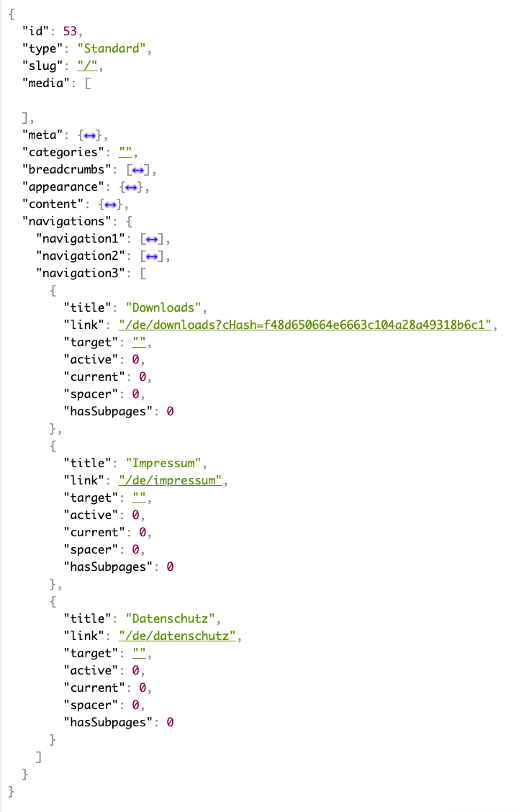

# TYPO3 Extension "headless_navigations" - Provides TypoScript definitions to enrich the [EXT:headless](https://github.com/TYPO3-Initiatives/headless) page response with proper navigations

This extension adds a "navigations" key to the default JSON response, provides constants to configure up to three custom navigations (e.g. "Main Navigation", "Meta navigation", "Side navigation") and outputs those as proper JSON to render menus in the Frontend applicaiton.

## Requirements
Extension requires TYPO3 in version at least 10.4.

## TYPO3 Installation
Install extension using composer\
``composer require friendsoftypo3headless/headless-navigations``

and then, include the TypoScript template, configure the constants and you are ready to go.

### Developers involved in the project

- [Sven Petersen](https://github.com/svenpet90) ([DAUSKONZEPT GmbH](https:///www.dauskonzept.de) && [HardAnders GbR](https://www.hardanders.de))
- [Niels Seelhöfer](https://github.com/derseeli) ([TRIXIE Heimtierbedarf GmbH & Co. KG](https://www.trixie.de) && [Datenanker](https://www.datenanker.com))
